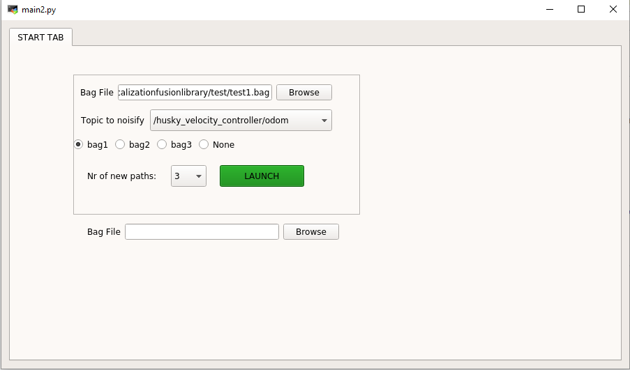
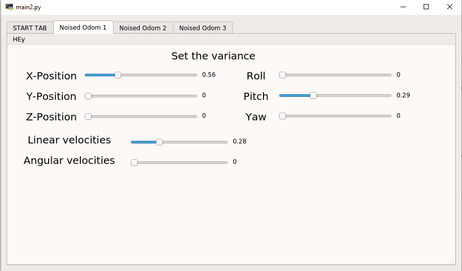

# ROS_noisifier
### Warning
 Bag1, Bag2, Bag3 are meaningless. They were hardcoded for ease of work and can be changed in gui/main.py
In my case they looked like this:
```
PATHS = [
    "test1.bag",
    "test2.bag",
    "test3.bag"
]
```

GUI create several noised paths from one path(i.e. add noise to odom topics)

```
git clone https://gitlab.iavgroup.local/mzhobro/ros_noisifier.git
cd ros_noisifier
# run with
python gui/main.py
```

Firstly choose the bag, nr of noised paths and topic you want to noisify:





Than dynamically add noise to the paths




# This is a demonstration of how to use PyQt with ROS

## Dependencies

Make sure to have the following installed

-   PyQt 5
-   PyQt 5 Designer
-   PyQt 5 dev tools

## Editing the _layout_

To edit the interface, open `layout.ui` in for example **Qt 5 Designer**:

```bash
/usr/lib/x86_64-linux-gnu/qt5/bin/designer layout.ui
```

Once all the changes are saved, run the following command

```bash
pyuic5 -x layout.ui -o layout.py
```

This will auto-generate all interface elements in Python code. The class it creates, `Ui_MainWindow` , is then imported and inherited by the main class in `main.py`

## Launching the code

Simply run `main.py`. All the logic happens in that file.
```bash
python main.py
```
